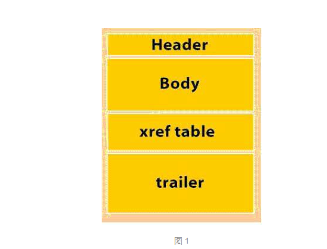

[参考博客](https://blog.csdn.net/pdfMaker/article/details/573990?utm_medium=distribute.pc_relevant.none-task-blog-BlogCommendFromMachineLearnPai2-2.channel_param&depth_1-utm_source=distribute.pc_relevant.none-task-blog-BlogCommendFromMachineLearnPai2-2.channel_param)

#### pdf规范

1. 对象, 一个PDF文档是由一组基本数据类型组成的数据结构。
2. 文件（物理结构）, 决定对象是如何存放在一个PDF文件中的， 它们是如何被访问的，如何被更新的。这个结构是独立于对象的语义的。
3. 文档结构, 说明一些基本的对象类型是如何来表现PDF文档的成分的：例如页，图片，字体，批注等。
4. 内容流，一个PDF文件内容流包含一系列的指令，描述页面的外观或其他图形实体的外观和文件内容。

Pdf文件的格式



Header  pdf文件的第一行   指明该文件所遵循的PDF规范的版本号。

Body   文件体  pdf文件的主要部分，由一系列对象组成。

Xref table 交叉引用表 为了能对间接对象进行随机存取而设立的一个间接对象的地址索引表。

Trailer 文件尾，声明了交叉引用表的地址，即指明了文件体的根对象（Catalog），从而能够找到PDF文件中各个对象体的位置，达到随机访问。另外还保存了PDF文件的加密等安全信息（以后详细讨论）。

文件尾（Trail），说明根对象的对象号，并且说明交叉引用表的位置，通过对交叉引用表的查询可以找到目录对象(Catalog)。这个目录对象是该PDF文档的根对象，包含PDF文档的大纲(outline)和页面组对象（pages）引用。大纲对象是指PDF文件的书签树；页面组对象（pages）包含该文件的页面数，各个页面对象(page)的对象号。

对象的结构

```
3 0 obj

<<

/Type /Pages

/Count 1

/Kids [4 0 R]

>>

endobj
```

第一个数字称为对象号，来唯一标识一个对象的，第二个是产生号，是用来表明它在被创建后的第几次修改，所有新创建的PDF文件的产生号应该都是0，即第一次被创建以后没有被修改过。上面的例子就说明该对象的对象号是3，而且创建后没有被修改过。

#### pdf解析
可以参考下面的博文：

[https://blog.csdn.net/weixin_38361347/article/details/89643568](https://blog.csdn.net/weixin_38361347/article/details/89643568)